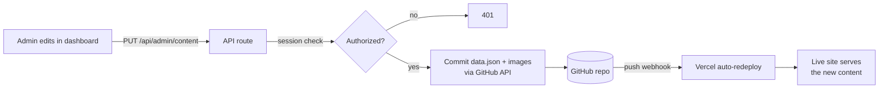

# GMunchies Vending — Marketing Site + Git-backed CMS 🍫🥤

A full-stack marketing website with a custom admin CMS, built for **GMunchies**, a vending solutions company (vending machines, office coffee, and micro-markets). Shared here as a portfolio case study.

The interesting part isn't the marketing pages — it's that the whole site is content-managed **without a database or a third-party CMS**. The admin dashboard commits content and images straight to a GitHub repo, and the deploy platform rebuilds from that commit.

**Live site:** https://www.gmunchiesvending.com

> **Tech:** Next.js 16 · React 19 · TypeScript (strict) · NextAuth (Google OAuth) · Zod · EmailJS · hand-written CSS · Vercel

<!-- Add a screenshot or GIF here, e.g.  -->

---

## ✨ Highlights

- **GitHub-as-CMS** — a custom admin dashboard commits `data.json` + uploaded images to a GitHub repo via the GitHub API. No database, no Contentful/Sanity.
- **Zero-setup demo mode** — `CMS_LOCAL_ONLY=1` runs the entire admin panel against a local JSON file, so you can try the full CMS with no GitHub token or OAuth app (see [Getting started](#-getting-started)).
- **Google-OAuth admin** — sign-in restricted to an email allowlist; no passwords stored.
- **Dynamic, content-driven pages** — services and locations render from CMS data with their own detail pages, and can be toggled on/off.
- **Type-safe content** — every CMS read/write is validated with a Zod schema, so malformed content can't reach the site.
- **Server-side contact form** — Zod-validated and sent via EmailJS from the server (no keys shipped to the browser).
- **SEO plumbing** — `sitemap.xml`, `robots.txt`, and JSON-LD structured data.
- **No CSS framework** — every component ships its own hand-written CSS.

---

## 🏗 Architecture: GitHub as the CMS

Instead of a database, published content lives in the Git repo itself (`src/content/data.json` + `public/uploads/`). Editing flows like this:



Why this is nice:
- **The repo is the single source of truth** — content is versioned, diffable, and revertable with plain Git.
- **No database to run, secure, or pay for.**
- **Preview & rollback for free** — every content change is a commit.

The GitHub target is configured with one env var (`GITHUB_REPO="owner/name"`), resolved in [`src/lib/github.ts`](src/lib/github.ts). In local/demo mode the same admin UI writes to disk instead — see below.

---

## 🚀 Getting started

```bash
git clone <your-fork-url>
cd gmunchies
npm install
cp .env.example .env.local   # then fill in values
npm run dev                  # http://localhost:3000
```

### Fastest path: demo mode (no GitHub / OAuth needed)

Set these in `.env.local` and you can run the full site **and** the admin CMS with zero external setup:

```bash
CMS_LOCAL_ONLY=1        # admin reads/writes local data.json instead of GitHub
NEXTAUTH_SECRET=...     # any value from: openssl rand -base64 32
NEXTAUTH_URL=http://localhost:3000
ADMIN_EMAILS=you@example.com
# ...plus Google OAuth vars if you want to actually log in to /admin
```

For the full GitHub-backed setup (token, repo target, EmailJS), see the comments in [`.env.example`](.env.example).

### Scripts

```bash
npm run dev      # dev server
npm run build    # production build
npm run lint     # ESLint (currently clean)
```

---

## 📁 Project structure

```
src/
├── app/                  # App Router routes (thin wrappers → featured/pages)
│   └── api/
│       ├── admin/        # CMS read/write, upload, media — session-protected
│       ├── auth/         # NextAuth (Google)
│       └── contact/      # Zod-validated → EmailJS (server-side)
├── components/
│   ├── sections/         # Page sections (Hero, NavBar, Footer, …)
│   └── ui/               # Reusable primitives (cards, form fields, …)
├── featured/
│   ├── pages/            # Full page compositions
│   └── admin/            # Admin dashboard
│       ├── Dashboard.tsx     # Orchestrator: state, load/save, media modal
│       ├── adminContext.ts   # Shares state/handlers with the mode editors
│       ├── adminUtils.ts     # deepClone / normSrc
│       └── modes/            # One editor per content type (Home, About, …)
├── content/data.json     # The CMS content (source of truth)
└── lib/                  # github.ts, authOptions.ts, schemas.ts (Zod), …
```

---

## 🔐 A few deliberate decisions

- **Admin auth is Google-OAuth + allowlist only** — no username/password to leak. Access is granted purely by verified email membership in `ADMIN_EMAILS`.
- **EmailJS runs server-side.** The API route forwards the browser's `Origin` header so EmailJS accepts the request, keeping the keys off the client.
- **Security headers** (CSP, HSTS, etc.) are set in `next.config.ts`.
- **Hand-written CSS per component** rather than a utility framework — a deliberate choice, kept consistent across the app.

---

## 📦 Deployment

Deploys to **Vercel** (zero-config for Next.js). Set the same variables from `.env.example` in the Vercel project settings, point `NEXTAUTH_URL` at the production URL, and add `{NEXTAUTH_URL}/api/auth/callback/google` to the Google OAuth authorized redirect URIs.

> Note: GitHub Pages can't host this — it needs a Node server for the API routes, auth, and dynamic pages.

---

## 📄 License

Code is released under the [MIT License](LICENSE). The **GMunchies** name, branding, and marketing content belong to the client and are shown here for portfolio/case-study purposes only.
